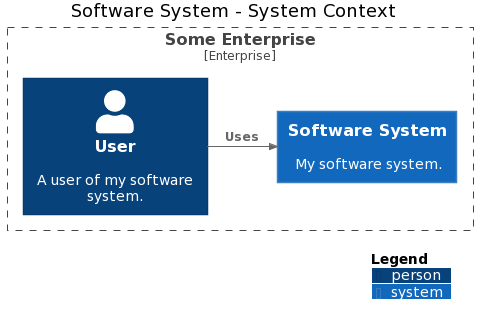
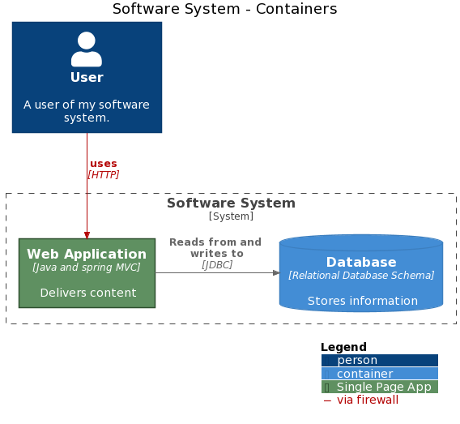
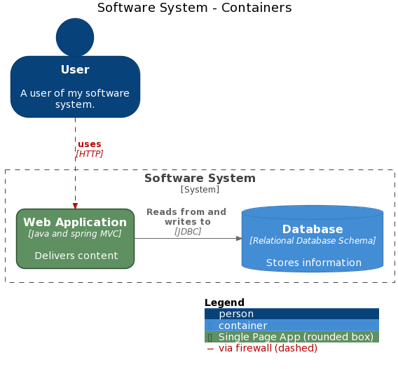

# C4-PlantUML

Structurizr for .NET also includes a simple exporter that can create diagram definitions compatible with [C4-PlantUML v2.2.0](https://github.com/plantuml-stdlib/C4-PlantUML).
Following diagram types are supported:

- Enterprise Context
- System Context
- Container
- Component
- Dynamic
- Deployment

Simply create your software architecture model and views as usual, and use the [C4PlantUMLWriter](../Structurizr.PlantUML/IO/C4PlantUML/C4PlantUMLWriter.cs) class to export the views. [For example](../Structurizr.Examples/C4PlantUML.cs):

```c#
Workspace workspace = new Workspace("Getting Started", "This is a model of my software system.");
Model model = workspace.Model;

model.Enterprise = new Enterprise("Some Enterprise");

Person user = model.AddPerson("User", "A user of my software system.");
SoftwareSystem softwareSystem = model.AddSoftwareSystem("Software System", "My software system.");
var userUsesSystemRelation = user.Uses(softwareSystem, "Uses");
// a direction could be added to relation (active in all views)
// userUsesSystemRelation.SetDirection(DirectionValues.Right);

ViewSet views = workspace.Views;
SystemContextView contextView = views.CreateSystemContextView(softwareSystem, "SystemContext", "An example of a System Context diagram.");
contextView.AddAllSoftwareSystems();
contextView.AddAllPeople();

// C4PlantUMLWriter support view specific directions too, e.g. "User" should be left of "Software System" only in this view
contextView.Relationships
    .First(rv => rv.Relationship.SourceId == user.Id && rv.Relationship.DestinationId == softwareSystem.Id)
    .SetDirection(DirectionValues.Right);

using (var stringWriter = new StringWriter())
{
    var plantUmlWriter = new C4PlantUmlWriter();
    plantUmlWriter.Write(workspace, stringWriter);
    Console.WriteLine(stringWriter.ToString());
}
```

This code will generate and output a PlantUML diagram definition that looks like this:

```
@startuml
!include <C4/C4_Context>

' Structurizr.SystemContextView: SystemContext
title Software System - System Context

Enterprise_Boundary(SomeEnterprise, "Some Enterprise") {
  System(SoftwareSystem__33c0d9d, "Software System", "My software system.")
  Person(User__378734a, "User", "A user of my software system.")
Rel_Right(User__378734a, SoftwareSystem__33c0d9d, "Uses")
}

SHOW_LEGEND()
@enduml
```

If you copy/paste this into [PlantUML online](http://www.plantuml.com/plantuml/), you will get something like this:



__Mark containers or components as database or via tags__

Additional to the relation directions (via .SetDirection(), see above) is it possible to activate the database symbols in the diagrams via component and container specific *.IsDatabase(true) calls.

[C4-PlantUML v2.2.0](https://github.com/plantuml-stdlib/C4-PlantUML) supports tags (via `.Tags =`) an styles (`.Styles.Add()`) too.

```c#
Container webApplication = softwareSystem.AddContainer("Web Application", "Delivers content", "Java and spring MVC");
// Additional tag element
webApplication.Tags = "Single Page App";

Container database = softwareSystem.AddContainer("Database", "Stores information", "Relational Database Schema");
// Additional mark it as database
database.SetIsDatabase(true);

var httpCall = user.Uses(webApplication, "uses", "HTTP");
// Additional tag relationship
httpCall.Tags = "via firewall";

webApplication.Uses(database, "Reads from and writes to", "JDBC").SetDirection(DirectionValues.Right);

// add corresponding styles
var styles = views.Configuration.Styles;
styles.Add(new ElementStyle("Single Page App") {Background = "#5F9061", Stroke = "#2E4F2E", Color = "#FFFFFF" });
styles.Add(new RelationshipStyle("via firewall") {Color = "#B40404", Dashed  = true });  // dashed is supported with next version see below

var containerView = views.CreateContainerView(softwareSystem, "containers", "");
containerView.AddAllElements();

using (var stringWriter = new StringWriter())
{
    var plantUmlWriter = new C4PlantUmlWriter();
    plantUmlWriter.Write(containerView, workspace.Views.Configuration, stringWriter);
    Console.WriteLine(stringWriter.ToString());
}
```

This code will generate and output a PlantUML diagram definition that looks like this:

```
@startuml
!include <C4/C4_Container>

' Structurizr.ContainerView: containers
title Software System - Containers

AddElementTag(Single Page App, $bgColor = "#5f9061", $fontColor = "#ffffff", $borderColor = "#2e4f2e")
AddRelTag(via firewall, $textColor = "#b40404", $lineColor = "#b40404")

Person(User__378734a, "User", "A user of my software system.")
System_Boundary(SoftwareSystem__33c0d9d, "Software System") {
  ContainerDb(SoftwareSystem__Database__202c666, "Database", "Relational Database Schema", "Stores information")
  Container(SoftwareSystem__WebApplication__2004eee, "Web Application", "Java and spring MVC", "Delivers content", $tags="Single Page App")
}
Rel(User__378734a, SoftwareSystem__WebApplication__2004eee, "uses", "HTTP", $tags="via firewall")
Rel_Right(SoftwareSystem__WebApplication__2004eee, SoftwareSystem__Database__202c666, "Reads from and writes to", "JDBC")

SHOW_LEGEND()
@enduml
```

You will get something like this:



__Use features of the next planned C4-PlantUML version (v2.3.0 ?)__

The next version will support the correct Person shape and e.g. dotted lines. These features can be activated via `.EnableNextFeatures=true`
(until the next version is released please use `.CustomBaseUrl="https://raw.githubusercontent.com/kirchsth/C4-PlantUML/extended/"`)

```c#
using (var stringWriter = new StringWriter())
{
    var plantUmlWriter = new C4PlantUmlWriter();
    plantUmlWriter.EnableNextFeatures = true;
    plantUmlWriter.CustomBaseUrl = "https://raw.githubusercontent.com/kirchsth/C4-PlantUML/extended/";

    plantUmlWriter.Write(containerView, workspace.Views.Configuration, stringWriter);
    Console.WriteLine(stringWriter.ToString());
}
```

This code will generate and output a PlantUML diagram definition that looks like this:

```
@startuml
!includeurl https://raw.githubusercontent.com/kirchsth/C4-PlantUML/extended/C4_Container.puml

' Structurizr.ContainerView: containers
title Software System - Containers

SHOW_PERSON_OUTLINE()
AddRelTag("Back", $textColor=$ARROW_COLOR, $lineColor=$ARROW_COLOR, $lineStyle = DottedLine())

AddElementTag(Single Page App, $bgColor = "#5f9061", $fontColor = "#ffffff", $borderColor = "#2e4f2e", $shape = RoundedBoxShape())
AddRelTag(via firewall, $textColor = "#b40404", $lineColor = "#b40404", $lineStyle = DashedLine())

Person(User__378734a, "User", "A user of my software system.")
System_Boundary(SoftwareSystem__33c0d9d, "Software System") {
  ContainerDb(SoftwareSystem__Database__202c666, "Database", "Relational Database Schema", "Stores information")
  Container(SoftwareSystem__WebApplication__2004eee, "Web Application", "Java and spring MVC", "Delivers content", $tags="Single Page App")
}
Rel(User__378734a, SoftwareSystem__WebApplication__2004eee, "uses", "HTTP", $tags="via firewall")
Rel_Right(SoftwareSystem__WebApplication__2004eee, SoftwareSystem__Database__202c666, "Reads from and writes to", "JDBC")

SHOW_LEGEND()
@enduml
```

You will get something like this:




## Benefits of using C4-PlantUML with Structurizr

The key benefit of using PlantUML in conjunction with the Structurizr client library is that you can create diagrams from a __model__ of your software system. The model provides a set of rules that must be followed; related to elements, relationships, and how they are exposed using diagrams. This means:

1. Rather than looking after a collection of disjointed PlantUML diagram definitions, you can create many PlantUML diagrams from a single model and keep them all up to date easily, especially if integrated with your continuous build server and build pipeline.
1. The naming of elements and the definition of relationships between elements _remains consistent across diagrams_.
1. The software architecture model at the component level can be created by extracting components from a codebase, using _static analysis and reflection techniques_.
