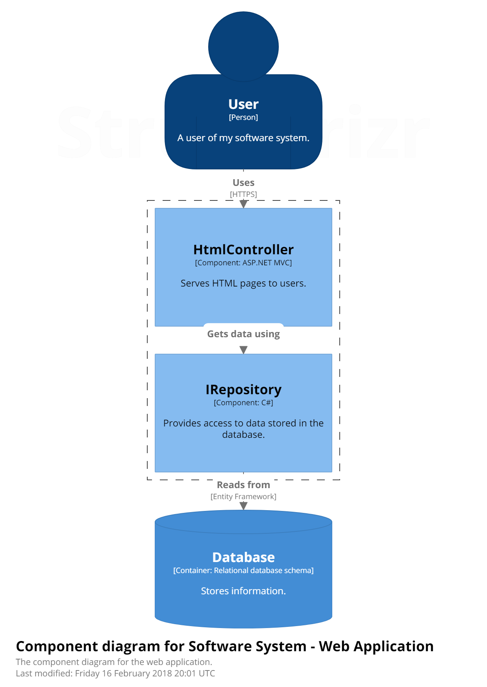

# Structurizr annotations

Structurizr for .NET includes some custom code annotation attributes that you can add to your code. These serve to either make it explicit how components should be extracted from your codebase, or they help supplement the software architecture model.

The attributes can be found in the [Structurizr.Annotations](https://nuget.org/packages/Structurizr.Annotations) NuGet package, which is a very small standalone JAR file containing only the Structurizr annotations. All attributes have a runtime retention policy, so they will be present in the compiled bytecode.

## [Component]

A type-level annotation that can be used to signify that the annotated type (an interface or class) can be considered to be a "component". The properties are as follows:

- Description: The description of the component (optional).
- Technology: The technology of component (optional).

## [CodeElement]

A type-level annotation that can be used to signify that the annotated type can be considered to be a supporting type for a component. The properties are as follows:

- Description: The description of the code element (optional).

## [UsedByPerson]

A type-level annotation that can be used to signify that the named person uses the component on which this annotation is placed, creating a relationship form the person to the component. The properties are as follows:

- Name: The name of the person (required).
- Description: The description of the relationship (optional).
- Technology: The technology of relationship (optional).

## [UsedBySoftwareSystem]

A type-level annotation that can be used to signify that the named software system uses the component on which this annotation is placed, creating a relationship from the software system to the component. The properties are as follows:

- Name: The name of the software system (required).
- Description: The description of the relationship (optional).
- Technology: The technology of relationship (optional).

## [UsedByContainer]

A type-level annotation that can be used to signify that the named container uses the component on which this annotation is placed, creating a relationship from the container to the component. The properties are as follows:

- Name: The name of the container (required).
- Description: The description of the relationship (optional).
- Technology: The technology of relationship (optional).

If the container resides in the same software system as the component, the simple name can be used to identify the container (e.g. "Database"). Otherwise, the full canonical name of the form "Software System/Container" must be used (e.g. "Some Other Software System/Database").

## [UsesSoftwareSystem]

A type-level annotation that can be used to signify that the component on which this annotation is placed has a relationship to the named software system, creating a relationship from the component to the software system. The properties are as follows:

- Name: The name of the software system (required).
- Description: The description of the relationship (optional).
- Technology: The technology of relationship (optional).

## [UsesContainer]

A type-level annotation that can be used to signify that the component on which this annotation is placed has a relationship to the named container, creating a relationship from the component to the container. The properties are as follows:

- Name: The name of the container (required).
- Description: The description of the relationship (optional).
- Technology: The technology of relationship (optional).

If the container resides in the same software system as the component, the simple name can be used to identify the container (e.g. "Database"). Otherwise, the full canonical name of the form "Software System/Container" must be used (e.g. "Some Other Software System/Database").

## [UsesComponent]

A field-level annotation that can be used to supplement the existing relationship (i.e. add a description and/or technology) between two components.

When using the various component finder strategies, Structurizr for .NET will identify components along with the relationships between those components. Since this is typically done using reflection against the compiled bytecode, you'll notice that the description and technology properties of the resulting relationships is always empty. The ```[UsesComponent]``` annotation provides a simple way to ensure that such information is added into the model.

The properties are as follows:

- Description: The description of the relationship (required).
- Technology: The technology of relationship (optional).

## Example

Here are some examples of the annotations, which have been used to create the following diagram.



```csharp
[Component(Description = "Serves HTML pages to users.", Technology = "ASP.NET MVC")]
[UsedByPerson("User", Description = "Uses", Technology = "HTTPS")]
class HtmlController
{

    [UsesComponent("Gets data using")]
    private IRepository repository = new EfRepository();

}
```

```csharp
[Component(Description = "Provides access to data stored in the database.", Technology = "C#")]
public interface IRepository
{

    string GetData(long id);

}
```

```csharp
[UsesContainer("Database", Description = "Reads from", Technology = "Entity Framework")]
class EfRepository : IRepository
{

    public string GetData(long id)
    {
        return "...";
    }

}
```

See [StructurizrAnnotations.cs](https://github.com/structurizr/dotnet/blob/master/Structurizr.Reflection.Examples/StructurizrAnnotations.cs) for the full source code illustrating how to use the various annotations in conjunction with the reflection-based component finder. The resulting diagrams can be found at [https://structurizr.com/share/38341](https://structurizr.com/share/38341). A Mono.Cecil based version of the example is also available; see its own [StructurizrAnnotations.cs](https://github.com/structurizr/dotnet/blob/master/Structurizr.Cecil.Examples/StructurizrAnnotations.cs) for source code and [https://structurizr.com/share/38339](https://structurizr.com/share/38339) for the resulting diagrams.